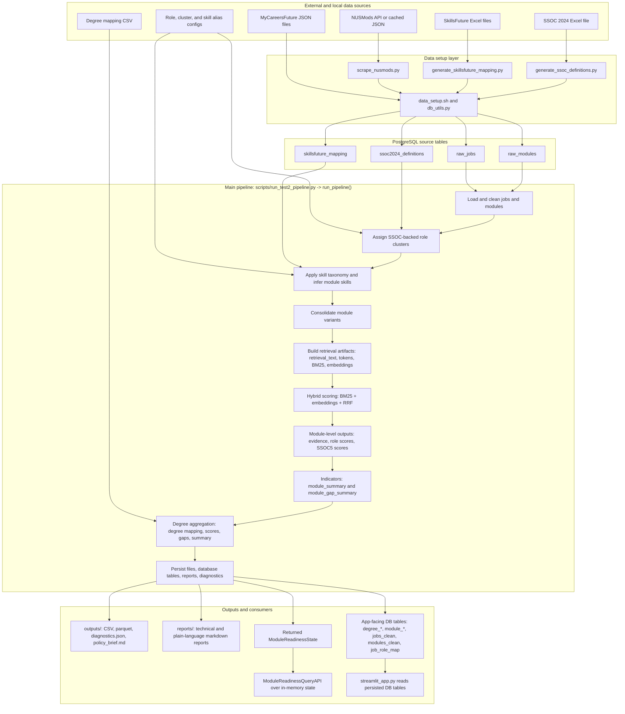

# Pipeline Workflow Diagram

This diagram is based on the actual repository flow in:

- `src/data_utils/` for source ingestion and database loading
- `src/module_readiness/orchestration/pipeline.py` for the main runtime pipeline
- `src/module_readiness/reporting/reports.py` and `streamlit_app.py` for downstream outputs

## End-to-End Workflow



## Runtime Sequence

```mermaid
sequenceDiagram
    autonumber
    actor User as "User or analyst"
    participant Setup as "data_setup.sh + generator scripts"
    participant DB as "PostgreSQL"
    participant Script as "scripts/run_test2_pipeline.py"
    participant Pipe as "run_pipeline()"
    participant Jobs as "load_jobs()"
    participant Roles as "assign_role_families()"
    participant Mods as "load_nus_modules()"
    participant Tax as "apply_skill_taxonomy()"
    participant Var as "consolidate_module_variants()"
    participant Ret as "build_retrieval_artifacts() + HybridRetrievalEngine"
    participant Score as "compute_scores()"
    participant Agg as "build_indicators()"
    participant Deg as "build_degree_outputs()"
    participant Persist as "file, report, and DB writers"
    participant Consumers as "Query API and Streamlit"

    User->>Setup: Prepare and load source data
    Setup->>DB: Write raw_jobs, raw_modules, skillsfuture_mapping, ssoc2024_definitions

    User->>Script: Run the pipeline
    Script->>Pipe: run_pipeline()

    Pipe->>Jobs: Read raw_jobs, clean text, normalize skills, filter scope
    Jobs->>DB: Read raw_jobs
    Jobs-->>Pipe: Cleaned jobs

    Pipe->>Roles: Assign role clusters and SSOC labels
    Roles->>DB: Read ssoc2024_definitions
    Roles-->>Pipe: Jobs with role_family, role_cluster, broad_family, SSOC names

    Pipe->>Mods: Read raw_modules and build module text
    Mods->>DB: Read raw_modules
    Mods-->>Pipe: Undergraduate module catalog

    Pipe->>Tax: Split technical and soft skills; infer module skills
    Tax->>DB: Read skillsfuture_mapping
    Tax-->>Pipe: Taxonomy-enriched jobs and modules

    Pipe->>Var: Merge suffix variants into base module codes
    Var-->>Pipe: Consolidated modules

    Pipe->>Ret: Build retrieval_text, token lists, BM25 indices, embedding cache
    Ret-->>Pipe: Retrieval artifacts and retrieval engine

    loop For each consolidated module
        Pipe->>Score: Rank matching jobs with BM25 and embeddings fused by RRF
        Score-->>Pipe: module_job_evidence rows
    end

    Pipe->>Score: Aggregate evidence into module_role_scores and module_ssoc5_scores
    Score-->>Pipe: Scored module tables

    Pipe->>Agg: Build module_summary and module_gap_summary
    Agg-->>Pipe: Module-level indicators

    Pipe->>Deg: Join degree mapping and aggregate degree outputs
    Deg-->>Pipe: degree_module_map, degree_skill_supply, degree_role_scores, degree_ssoc5_scores, degree gaps, degree_summary

    Pipe->>Persist: Write CSV/parquet snapshots, markdown reports, diagnostics.json
    Persist->>DB: Persist app-facing output tables
    Persist-->>Pipe: Outputs saved

    Pipe-->>Script: Return ModuleReadinessState
    Script->>Consumers: Query API can search jobs and recommend modules from state
    DB->>Consumers: Streamlit app reads persisted degree and module tables
```

## Notes

- Raw data ingestion happens before the main scoring pipeline. The pipeline itself starts from database tables rather than from raw files.
- `load_jobs()` narrows the job corpus to early-career, degree-level postings.
- `load_nus_modules()` narrows the module corpus to undergraduate modules and assembles the retrieval text inputs.
- The retrieval stage uses both BM25 and sentence-transformer embeddings, then combines them with reciprocal rank fusion.
- Degree outputs are built from module-level outputs and the degree mapping file; they do not rerun ingestion or retrieval.
- The Streamlit app is read-only and consumes persisted database tables instead of rerunning the pipeline.
